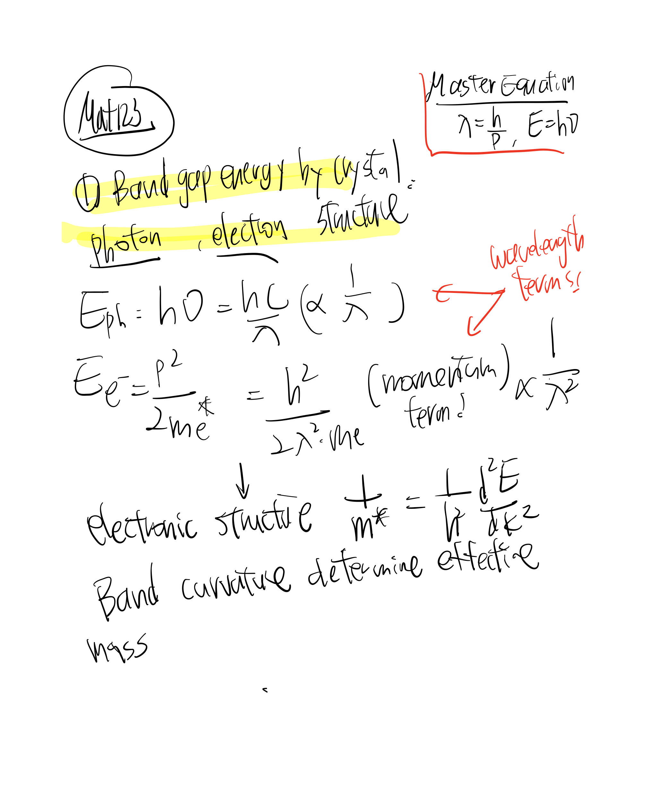
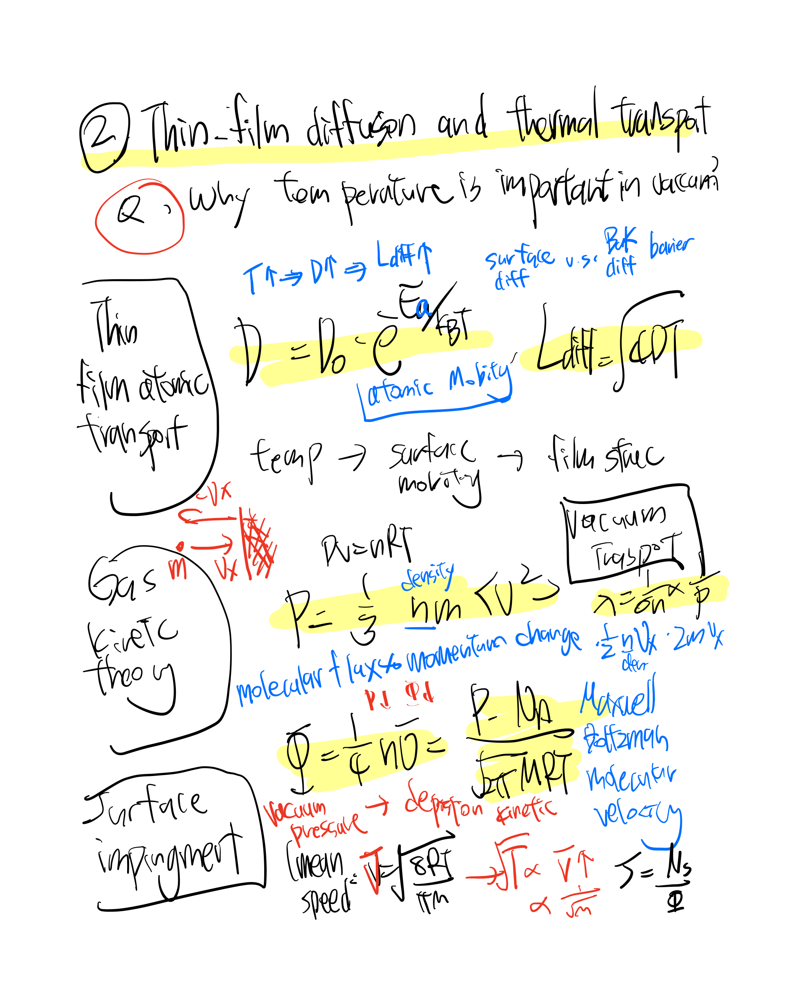
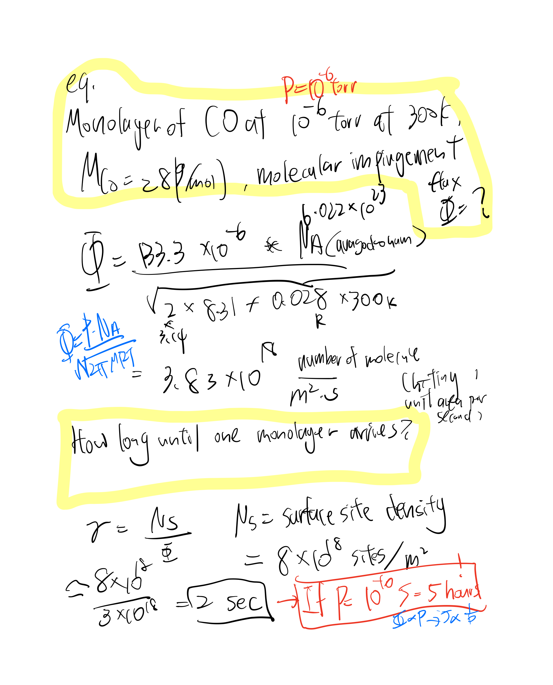

# MATSCI123-Electronic-Materials-Processing

## Textbook Source 
Dopants and Defects in Semiconductors 
Electronic Properties of Materials (Rolf E. Hummel)
Materials Science of Thin Films. Deposition and Structure (Ohring)

## Concepts
Solid State Physics (Band, defects in semiconductor and oxides,) -> bulk semiconductor crystal growth and processing : doping , diffusion , implantation -> thin film deposition and processing -> Material Analysis and Characterization

- **Semiconductor physics** -photon energy, phonon energy, energy vs momentum (k) diagram for an indirect bandgap semiconductor, Carrier mobility and applied electronic field, current-voltage (I-V) curve for a pn junction, electron concentration and inverse temperature for an intrinsic semiconductor
- **Electronic material processing**:  Control over how atoms, elec
- Gases, vacuum, pressure I
- Gases, vacuum, pressure II
- Physical vapor deposition (thermal & e-beam)
- Sputtering I & II
- MBE, PLD
- CVD
- Epitaxy I & II
- Ion implantation and annealing I & II
- Lithography and etching
- Oxidation
- Characterization – chemical, structural, electrical, optical

## Discusion 0: Those structural change modify electronic properties , device properties 
- Review 1- Electronic Materials Processing /  Solid State Science
PN and Metal-Semiconductor Junctions

  
1. Energy Band Structure: How they formed and what they mean: Reciprocal solid atom lattice with overlap atomic orbital forms molecular orbitals -> Bond gap diagram (Conduciton/ Valence Band) for Metal v.s. semiconductor / insulator 
1.1 Reciprocal Lattice (Momentum-Space) - k : wavenumber 
1.2 Semiconductor trends
2. Intrinsic and Extrinsic Semiconductor
2.1 Electron and Holes
2.2 Dopant and free carrier in Silicon
2.3 Effective Mass
2.4 Density of States
2.5 Fermi-Dirac Distribution Function for energy distribution
2.6 Carrier Concentration / acceptor , donor, effective mass, fermi function
2.7 Drift and Diffusion current mechanism (Electric field, Diffusion)

3.Semiconductor Junction and Contacts

---

## Applied Materials Characterization Project — Silicon Dioxide (SiO₂) in UCSD- Materials Research Science and Engineering Center

This experimental materials analysis project attached in aim to connect semiconductor processing fundamentals  ,which I characterized a hydrated SiO₂ submicron particle system using complementary chemical, structural, surface, colloidal, morphological, and thermal techniques.

The project applies concepts from electronic materials processing and semiconductor characterization through FTIR, Raman spectroscopy, SEM, DLS, zeta potential, contact-angle analysis, XRF, TGA, and DSC. The combined results were used to evaluate Si–O–Si bonding, surface hydroxylation, particle size and aggregation, surface charge, composition, and thermal behavior.

This project demonstrates the relationship:

Processing / Material State → Structure & Surface Chemistry → Measured Properties → Characterization & Interpretation

## View Full SiO₂ Characterization Project -> [UCSD-MRSEC Project](https://docs.google.com/document/d/1n6j6AtY1mRAR7bK_CfmxCuf1xAbGKlog/edit?usp=sharing&ouid=108924249682329290569&rtpof=true&sd=true)

---

## Practice 

Find one scientific article in a peer-reviewed journal that discusses the layered semiconductor germanium disulfide,EqGeS2. i) Identify and describe the synthesis process including synthesis method and conditions (e.g., synthesis/processing temperatures, pressure, source materials, etc.). ii) What properties are explored (chemical, electrical, optical, etc.)? iii) What techniques are used to explore these properties? iv) Are there additional processing conditions (e.g., metals used to form electrical contacts, surface treatments, etc.)

## Notes: Flux is so important in impringement! 
## Discussion 1: Why under lower pressure (Better Vaccuum), the thin film of silicon survive longer ? 

## Discussion 2 : How long it might take to create a vaccuum? 
- (Thin film evaporation process, Discharge , plasmas and ion-surface interaction,Plasma and Ion Beam Processing of Thin Films  / materials science of thin films ch3,4,5 ,Ohring)

- Topics: Electronic Structure -> vaporized atoms/molecules -> gas/vacuum transport -> arrival at substrate  -> condensation/film growth / removal -> device properties**
- **Concept flow**:  Vacuum -> source evaporation -> atomic flux ->  transport to substrate -> film thickness/uniformity  -> conformality
- Why heat up cause evaporation?
- What happens after atom evaporate ? / How deposition happens?
- Evaporation is a physical deposition process  

## Discussion 3 

- Clausins - Claphyeron relation

## Handout 1 Concepts: Thin Films, Gas Kinetics, Vacuum

1. **Thin Film Operations:** Add / Deposition, Remove / Etching, Modify / Surface Treatment
2. **Thin Film Definition:**
   A layer of material that meets one or more of the following criteria:
   - **i) Synthesis:** Vapor- or liquid-phase transport of atoms or molecules to a substrate whereby the film forms via attachment (deposition) onto and/or reaction at the surface.
   - **ii) Microstructure:** Layer morphology is governed by its interaction with the substrate.
   - **iii) Properties / Functionality:** Not attainable in bulk form.
3. **What makes thin film growth different from bulk?**
   Activation Energy Barrier:
   $$E_{\text{bulk}} \sim 4\text{ eV}, \qquad E_{\text{surface}} \sim 1\text{ eV}$$

   - **Diffusivity:**
     $$D = D_0 \exp\left(-\frac{E_a}{k_B T}\right)$$
     $$L_{\text{diff}} = \sqrt{4Dt}$$
     $$E_a \downarrow \; \Rightarrow \; D \uparrow \; \Rightarrow \; L_{\text{diff}} \uparrow$$

4. If we want to understand gas-based growth, we must understand the motion/flow of atoms and molecules in the gas phase in space.## Handout 1 Concepts: Thin Films, Gas Kinetics, Vacuum

1. **Thin Film Operations:** Add / Deposition, Remove / Etching, Modify / Surface Treatment
2. **Thin Film Definition:**
   A layer of material that meets one or more of the following criteria:
   - **i) Synthesis:** Vapor- or liquid-phase transport of atoms or molecules to a substrate whereby the film forms via attachment (deposition) onto and/or reaction at the surface.
   - **ii) Microstructure:** Layer morphology is governed by its interaction with the substrate.
   - **iii) Properties / Functionality:** Not attainable in bulk form.
3. **What makes thin film growth different from bulk?**
   Activation Energy Barrier:
   $$E_{\text{bulk}} \sim 4\text{ eV}, \qquad E_{\text{surface}} \sim 1\text{ eV}$$

   - **Diffusivity:**
     $$D = D_0 \exp\left(-\frac{E_a}{k_B T}\right)$$
     $$L_{\text{diff}} = \sqrt{4Dt}$$
     $$E_a \downarrow \; \Rightarrow \; D \uparrow \; \Rightarrow \; L_{\text{diff}} \uparrow$$

4. If we want to understand gas-based growth, we must understand the motion/flow of atoms and molecules in the gas phase in space. Microscopic kinetic gas pressure  $$\[P=(\text{flux})(\text{momentum change per molecule})\]$$ $$= \[P=\left(\frac12 nv_x\right)(2mv_x)\]$$ $$\[{\overline{v_x^2}=\overline{v_y^2}=\overline{v_z^2}=\frac13\overline{v^2}}\\]$$ , $$\[{P=\frac13n\overline{v^2}\frac{M}{N_A}}.\]$$

## HW Practices
### 1: Derive Mean molecular gas kinetic energy with molecular collision from Bolzman probability distribution of Velocity to Ideal gas equation
Two form of Ideal gas density, 1 use **number density of gas molecule** n per **avogadro number**, one use number of moles / amount of gas molecules

### 2: Create Vacuum Chamber system by cryopump with aperture and Mechanical Pump by pressure difference for Pulsed Laser Deposition

### 3: Deposition Rate 

### 4

